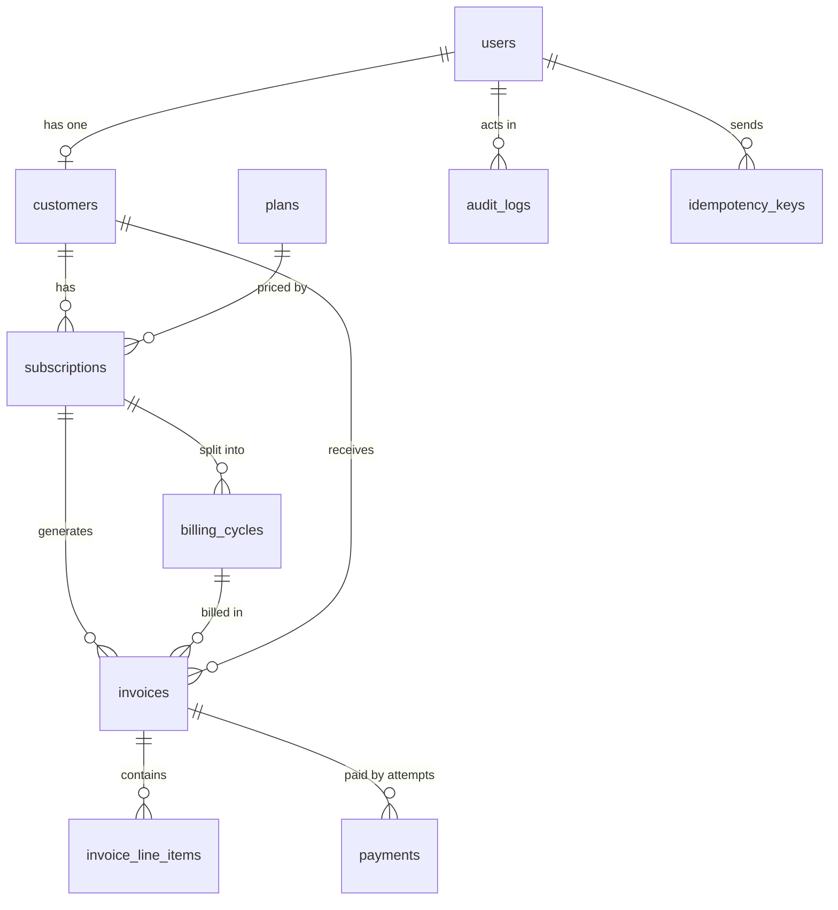

# BillWise database schema (Module 1, Step 2)

## Rules that apply to every table
- Primary keys are UUIDs (safe to expose in URLs, can't be guessed or counted).
- Money is an **integer in paise** (Rs 499.00 = `49900`). Never floats: `0.1 + 0.2 != 0.3`.
- Datetimes are `timestamptz` and always UTC.
- Every table has `created_at`; most have `updated_at`.

## The tables in plain language

| Table | What it is | Key columns |
|---|---|---|
| `users` | A login. Has a role (admin/customer). | email (unique), hashed_password, role, is_active |
| `plans` | A price list entry: Free, Starter, Pro, Business, Enterprise. | code (unique), price_minor, billing_interval, trial_days |
| `customers` | The billing identity of a user (name, phone, gateway id). One user -> one customer. | user_id (unique FK), razorpay_customer_id |
| `subscriptions` | "Customer X is on Plan Y right now", plus its lifecycle status. | customer_id, plan_id, status, current_period_start/end |
| `billing_cycles` | One billing period of a subscription (month 1, month 2...). Invoices belong to a cycle. | subscription_id, cycle_number, period_start/end |
| `invoices` | The bill for one cycle (or a mid-cycle plan change). | number (unique), status, subtotal/tax/total_minor |
| `invoice_line_items` | The rows on an invoice. Signed amounts: a proration credit is negative. | invoice_id, kind, description, amount_minor |
| `payments` | One attempt to pay an invoice via the gateway. Failed attempts are kept (dunning needs them). | invoice_id, status, gateway_order_id, attempt_number |
| `idempotency_keys` | Remembers "I already handled request with this key" and the response I gave. | key (unique), response_status, response_body |
| `audit_logs` | Append-only record of who did what. | actor_user_id, action, entity_type, entity_id |

## Relationships

## Design decisions worth explaining in an interview
1. **Why `customers` separate from `users`?** Login identity and billing identity change for
   different reasons (an admin is a user but never a customer).
2. **Why line items instead of one amount on the invoice?** Proration needs the base fee and
   the adjustment shown separately, and the invoice total is *derived* from them.
3. **Why many `payments` per invoice?** A failed card then a retry are two real events;
   overwriting would destroy the dunning history.
4. **Why `idempotency_keys`?** A network retry must not charge a customer twice.
5. **Why `audit_logs` is append-only?** An audit trail you can edit is not an audit trail.
6. **Why not store `plan` name text on the subscription?** Plans get edited; the FK keeps
   history consistent and `billing_cycles.plan_id` records what was charged each period.
